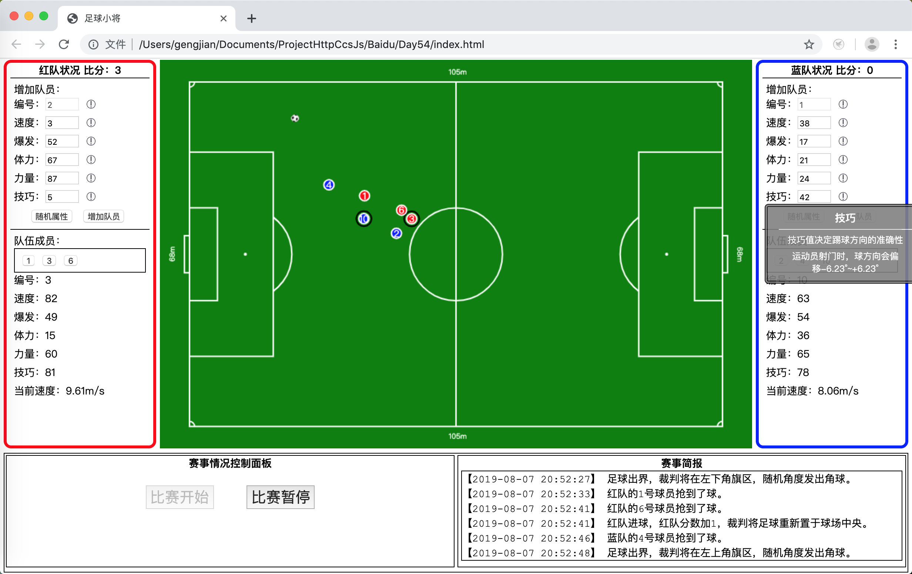

# 百度前端技术学院  
## 第五十四天到第五十七天：足球小将（一）

### 作品展示
展示链接 [[点击进入]](https://gengjian1203.github.io/BaiDuIFE_Day25/)  

### 课程目标  
通过趣味练习，来强化对于 JavaScript 的熟悉  
持续练习如何对于问题进行抽象，应用面向对象或者各种设计模式进行问题的解决  

### 创建一个足球场
通过 Canvas 或者 SVG 绘制一片绿色矩形，就像是我们从高空俯视绿色草坪足球场看见的一样。  
有余力的同学，可以把足球场上的各种边线画上。  
应用工厂模式，设计一个生成足球场的类  
足球场包括长度，宽度的属性，长度宽度创建时候以模拟真实单位的“米”为参数，同时以容器宽度和高度进行对应换算。  

### 创建一个足球运动员
通过 Canvas 或者 SVG 或者 DOM 创建一个足球运动员。  
我们将足球运动员抽象为一个实心圆，不需要考虑他的方向问题。  
创建球员的时候，需要将球员创建到某个球场中，球员圆形的大小默认为2米，按照和球场的大小进行对应像素的换算。  
球员有很多关于足球运动能力的属性，比如速度，力量，技术，射门等等。我们先添加一个属性，叫做速度。  
速度 VNum 为一个在1-99范围内的整数，随机生成。对应物理概念可以假设为：  
* 速度值为 99 的，最高速度为 12米每秒
* 速度值为 1 的，最高速度为 3米每秒
假设速度值和最高速度是线性关系，我们推导出如下公式：  
* 最高速度VMax = 3 + (VNum - 1) * ( 9 / 98 )

### 让球员跑起来
给球员增加一个方法，奔跑，指定一个终止点（相对于球场左上角的米的坐标），球员向那个终止点跑去。  
使用上一个需求中的球员速度，以及和球场实际大小进行计算，模拟一个球员奔跑中，球员圆圈移动的动画。  
为了测试方便，再给球员设置一个方法，设定球员所在位置，参数为相对于球场左上角的用米为单位的坐标，需要转换为像素  
注意：球员不可能一直按着最高速度进行奔跑，球员有起步，加速到全速，到终点后降速的过程  

### 让球员跑得更真实
我们知道，球员跑步速度不仅仅和最高速度有关系，还和体力，爆发力相关  
爆发力强，则加速到最快速度会比较快，  
体力好，坚持在最高速度会比较久  
所以给球员增加这两个属性，然后再让大家奔跑看看。  
爆发力和体力依然用 1-99 范围内的整数来设定，假设有如下物理意义：  
* 爆发力为 99 表示能够在 1 秒就达到最高速度
* 爆发力为 1 表示需要 4 秒才能达到最高速度
假设爆发力和需要多长时间达到最高速度是线性关系，请自行推导公式  
* 体力为 99 表示能够在最高速度上坚持 15 秒
* 体力为 1 表示能够在最高速度上坚持 10 秒
假设体力和能够在最高速度上坚持的时间是线性关系，请自行推导公式  

## 第五十八天到第六十二天：足球小将（二）

### 课程目标
通过趣味练习，来强化对于 JavaScript 的熟悉  
持续练习如何对于问题进行抽象，应用面向对象或者各种设计模式进行问题的解决  

### 创建一个足球
创建一个足球，用一个圆形表示，足球大小的直径假设为0.5米（不太真实，但为了看清），实际显示大小按照球场像素进行对应变化。  
足球不妨找一个图片做贴图  
足球有一个方法是移动，参数为运动方向、初速度、加速度，先假设足球只在草地平面移动。加速度为全局常量。  

### 跑向足球
#### 跑向静止的足球
实现运动员跑向足球并停球的行为。  
随机生成足球和运动员的位置，然后运动员向足球跑去，直到运动员和足球相接后，运动员和足球停下来。  
#### 跑向移动的足球
随机生成足球和运动员的位置，并让足球开始移动，接下来让运动员进行一个预判，并开始向足球可能接到的位置跑去，跑的过程中可能需要定期调整运动员奔跑的方向。  

### 踢出足球
#### 简单地踢出足球
给足球运动员增加一个踢出足球的方法，参数为期望球运动的方向，期望足球初速度。  
我们先简单实现踢出足球的实现，按照给定的参数，踢出足球。  
实现以下踢球：  
* 球员在球场中心向球门踢出足球
* 球员从小禁区向球场中心踢出足球
* 球员从角球区向点球点踢出足球
* 球员从大禁区角附近，向球门踢出足球
* 球员从本方禁区附近向对方半场边线踢出足球
#### 给球员增加两个属性
现在，我们稍微模拟一下真实情况，我们给球员增加两个属性：技术、力量  
技术决定运动员踢球方向的准确性和力量控制的准确性，力量决定踢球的最大速度。  
两个属性依然都是 1-99 的正整数。  
  
对于力量的设定可以为：  
* 力量为 1 的静止运动员踢出静止足球的最大初速度为 5米/秒
* 力量为 99 的静止运动员踢出静止足球的最大初速度为 50米/秒
* 力量和静止态踢出静止足球的最大初速度为线性关系
* 运动状态的球员可以提升或减小踢出足球的最大初速度，以球员运动方向和踢出足球方向来计算，方向完全相同，加速最大，方向完全相反，减速最大。范围为-40%到40%。
  
对于技术的设定可以为：  
* 技术对于方向及力量的控制符合正态分布
* 技术值越低，实际踢出的方向越容易出现和期望方向角度偏离的情况
* 技术值越高，实际踢出的方向越不容易出现和期望方向角度偏离的情况
* 技术值越低，实际踢出的初速度越容易出现和期望初速度偏离的情况，注意实际初速度不能超过最大初速度
* 技术值越高，实际踢出的初速度越不容易出现和期望初速度偏离的情况，注意实际初速度不能超过最大初速度
* 技术值越低，正态分布的方差越大
* 技术高越低，正态分布的方差越小
* 技术值与方差大小可以为线性关系，也可以自定义

### 环境
* 硬件环境  
MacBook Pro
* 软件环境  
MacOS (10.14.2)  
VS Code (version 1.36)  
Google Chrome (75.0.3770.100)  
Firefox (67.0.4)  

### 相关链接
[百度前端技术学院-第五十四天到第五十七天：足球小将（一）](http://ife.baidu.com/course/detail/id/62)  
